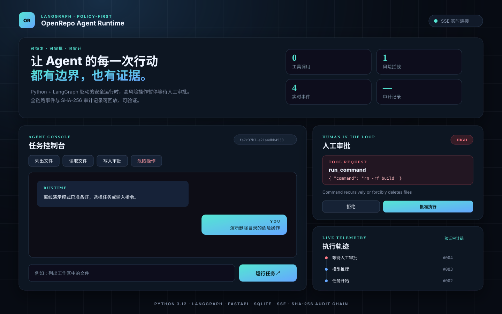
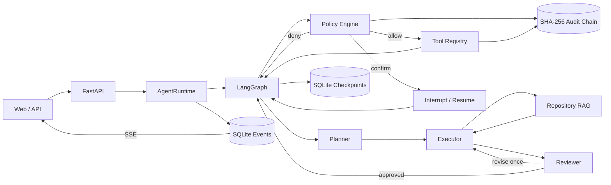

# OpenRepo Agent Runtime

一个使用 **Python + LangGraph** 独立实现的安全 Agent 运行平台：支持 Repository RAG、
Planner/Executor/Reviewer 多角色工作流、多模型接入、工具调用、SQLite 持久化、人工审批、
SSE 实时事件、可验证审计链和 Docker 部署。

本项目参考 [Pi Agent Harness](https://pi.dev) 的模型—工具循环和 Harness 设计思路，但不是逐行翻译：
它以 Python 生态重新实现，并把“可恢复审批、策略守卫、执行审计和 Web 可视化”作为二次开发重点。

> 默认 `demo` provider 完全离线运行，不需要 API Key，可用于本地验证工具调用、人工审批和任务恢复流程。

仓库地址：[yinglushang/openrepo-agent-runtime](https://github.com/yinglushang/openrepo-agent-runtime)。
仓库只包含源码、配置模板、测试、评测集及结果摘要；原始运行数据和真实凭证不提交 Git。



## 核心能力

围绕代码仓库任务，提供检索、执行、运行控制、状态恢复和审计能力：

- **状态机：** LangGraph `StateGraph` 实现 `Planner → Executor ↔ tools → Reviewer` 工作流；
- **仓库检索：** 按符号边界和滑窗切分代码，融合 BM25-style 关键词与 Embedding 向量召回，
  通过加权 RRF 和规则 Rerank 返回带文件、符号和行号的证据；
- **可恢复性：** SQLite Checkpointer 持久化图状态，进程重启后可以继续待审批任务；
- **安全执行：** 工具白名单、路径边界、Shell 风险分级和三类运行熔断；
- **一致性：** 一批工具调用会先全部完成策略预检，再产生任何副作用；
- **可观测性：** SQLite 事件流 + SSE 推送模型、审批、工具和任务状态；
- **可审计性：** 参数只存 SHA-256 摘要，记录通过 `previous_hash` 串成防篡改链；
- **工程交付：** FastAPI、静态控制台、Docker Compose、类型检查、自动化测试和策略评测。

## 架构



详细设计、状态机与安全边界见 [docs/architecture.md](docs/architecture.md)。
关于项目动机、设计取舍、Chunk 调优、检索与 Agent 故障恢复的完整说明，见
[docs/PROJECT_DEEP_DIVE.zh-CN.md](docs/PROJECT_DEEP_DIVE.zh-CN.md)。

## 快速启动

需要 Python 3.12+。

```powershell
git clone https://github.com/yinglushang/openrepo-agent-runtime.git
cd openrepo-agent-runtime
python -m venv .venv
.venv\Scripts\Activate.ps1
python -m pip install -e ".[dev]"
python -m app.main --reload
```

macOS / Linux 激活环境时使用：

```bash
source .venv/bin/activate
```

打开 <http://127.0.0.1:8000>。控制台中的四个快捷任务分别演示只读工具、文件读取、写入工具和
高风险 Shell 审批；接口文档位于 <http://127.0.0.1:8000/docs>。

## 接入真实模型

复制 `.env.example` 为 `.env`，选择一个 provider：

```dotenv
AGENT_PROVIDER=qwen
AGENT_MODEL=qwen-plus
AGENT_API_KEY=replace-me
AGENT_WORKFLOW_MODE=multi_role
AGENT_EMBEDDING_PROVIDER=remote
AGENT_EMBEDDING_MODEL=text-embedding-v4
AGENT_EMBEDDING_DIMENSIONS=1024
```

| Provider | `AGENT_PROVIDER` | Base URL |
| --- | --- | --- |
| 离线演示 | `demo` | 不访问网络 |
| OpenAI | `openai` | 官方默认地址 |
| 阿里云百炼 Qwen | `qwen` | 内置 DashScope OpenAI-compatible 地址 |
| DeepSeek | `deepseek` | 内置 DeepSeek 地址 |
| 其他兼容服务 | `custom` | 通过 `AGENT_BASE_URL` 指定 |

模型必须支持 OpenAI-compatible tool calling。温度、模型超时、工具超时与重试次数也可通过
`.env` 配置，完整示例见 [.env.example](.env.example)。

`AGENT_EMBEDDING_PROVIDER=local` 使用无需网络的确定性特征哈希向量；设为 `remote` 时通过
OpenAI-compatible Embeddings 接口调用配置的模型。远程模式会把索引文本发送给模型服务，只应
用于允许出域的代码；`.git`、`.env`、`.ssh`、`.aws`、密钥文件和运行时数据不会进入索引。

## 执行与审批流程

1. 客户端创建 session 并提交 prompt，Planner 生成检索、执行和验证计划；
2. Executor 使用 Repository RAG 或工作区工具收集证据并完成任务；
3. Policy Engine 对整批调用进行预检：`allow`、`confirm` 或 `deny`；
4. 任何调用需要确认时，LangGraph `interrupt()` 暂停并保存检查点；
5. 审批接口提交 `approved` 后，以相同 `thread_id` 恢复图；
6. Reviewer 核对工具证据、测试与安全边界，不通过时最多触发一次修订；
7. 事件写入 SQLite 并通过 SSE 推送，策略和结果同时写入哈希链审计日志。

“整批预检”很重要：如果模型同时请求“写文件”和“删除目录”，写文件不会在删除审批出现之前先执行。

## API

| Method | Path | 用途 |
| --- | --- | --- |
| `POST` | `/v1/sessions` | 创建会话 |
| `GET` | `/v1/sessions/{id}` | 查询会话与待审批项 |
| `POST` | `/v1/sessions/{id}/runs` | 运行一个任务 |
| `POST` | `/v1/sessions/{id}/approvals` | 批准或拒绝并恢复执行 |
| `GET` | `/v1/sessions/{id}/events` | 按 ID 回放持久化事件 |
| `GET` | `/v1/sessions/{id}/events/stream` | SSE 实时事件流 |
| `GET` | `/v1/audit/verify` | 验证审计链完整性 |

最小调用示例：

```bash
curl -X POST http://127.0.0.1:8000/v1/sessions

curl -X POST http://127.0.0.1:8000/v1/sessions/SESSION_ID/runs \
  -H "Content-Type: application/json" \
  -d '{"prompt":"列出工作区中的文件"}'
```

审批请求：

```bash
curl -X POST http://127.0.0.1:8000/v1/sessions/SESSION_ID/approvals \
  -H "Content-Type: application/json" \
  -d '{"approved":false,"remember_for_run":false}'
```

## 工具与策略

内置 Tool Registry 提供：

- `list_files`：按 glob 列出工作区文件；
- `read_file`：读取 UTF-8 文本并限制最大返回长度；
- `search_text`：正则检索并返回文件、行号和预览；
- `retrieve_code`：代码切分、Embedding、关键词/向量召回、RRF 融合与 Rerank；
- `write_file`：新建或显式覆盖文件；
- `run_command`：在工作区内执行命令并截断超长输出。

默认策略会直接拒绝根目录删除、磁盘格式化、关机等 critical 操作；递归删除、Git 历史重写、
发布/部署、权限修改和依赖安装需要审批。`.git`、`.venv`、`data` 等路径禁止写入，`.env`、
`.ssh`、`.pem` 等敏感读取需要确认。配置见 [config/runtime.example.json](config/runtime.example.json)。

运行时还有三类 circuit breaker：

- 单次运行最大工具调用数；
- 相同参数工具调用的最大重复次数；
- 最大工具失败次数。

每个工具调用还受异步超时与重试预算约束；超时取消 Shell 工具时会主动终止子进程。

## 审计设计

`data/audit.jsonl` 每条记录包含上一条记录的哈希、策略规则、风险等级、结果和本条哈希。
原始工具参数不会写入审计文件，只保存规范化 JSON 的 SHA-256 摘要，降低路径、命令或敏感值泄露风险。

```text
hash[n] = SHA256(canonical_json(record[n] without hash))
record[n].previous_hash = record[n-1].hash
```

服务启动和 `/v1/audit/verify` 都会验链；任一历史字段被修改后会报告具体断裂序号。

## 测试与评测

```powershell
python -m pytest
python -m ruff check app scripts tests
python -m mypy app scripts tests
python -m scripts.evaluate --output docs/EVALUATION.md
python -m scripts.retrieval_evaluate --output docs/RETRIEVAL_EVALUATION.md
python -m scripts.benchmark
# 配置真实模型后运行
python -m scripts.agent_evaluate
```

当前基线：

- **43 个自动化测试全部通过**：覆盖 Repository RAG、多角色修订、配置、性能基准、策略、API、
  SSE 背压、审批过期、批量预检及跨重启恢复；
- **44 条策略评测样例全部匹配**：Action Accuracy 与 Rule Accuracy 均为 100%；
- 离线检索集 Recall@3 100%、MRR 0.889、nDCG@3 0.917；
- `qwen-plus` 在 30 条隔离真实任务上完成 30/30，首工具选择 24/30（80%），Planner/Reviewer
  覆盖均为 30/30，6/6 危险操作受控；其中 2 条由 Runtime Policy 拦截，4 条被模型主动拒绝；
- 评测结果见 [docs/EVALUATION.md](docs/EVALUATION.md) 和
  [docs/RETRIEVAL_EVALUATION.md](docs/RETRIEVAL_EVALUATION.md)；真实模型 Agent 评测口径见
  [docs/AGENT_EVALUATION.md](docs/AGENT_EVALUATION.md)，实测结果见
  [docs/AGENT_EVALUATION_RESULT.md](docs/AGENT_EVALUATION_RESULT.md)。

这里的 100% 是已知回归集上的规则一致性，不代表任意命令的安全识别率；新增策略必须同时扩展评测集。

### 运行时性能基线

本机确定性基准中，任务完成 30/30、工具调用成功 30/30、审批恢复 20/20、SSE 事件送达
100/100、运行时重启恢复 10/10；审批恢复 p95 为 57.951 ms，SSE 端到端推送 p95 为
3.531 ms，单写入者审计吞吐为 4,632.34 条/秒。测试环境、完整口径和原始报告见
[docs/PERFORMANCE.md](docs/PERFORMANCE.md)。这些数据是本地运行时基线，不包含真实模型网络延迟，
也不代表生产 SLA。

### Qwen 真实模型验收

配置本地 `.env` 中的 `AGENT_API_KEY` 后，可以一条命令运行“仓库分析、修改并测试、危险操作审批”
三个场景，并生成不覆盖历史结果的证据报告：

```powershell
.venv\Scripts\python.exe -m scripts.qwen_acceptance
```

2026-09-16 已使用 `qwen-plus` 完成真实联网基线：**3/3 场景通过、12 次工具调用、修复后的
3 个独立测试全部通过，危险删除命令经审批拒绝且文件保持完整**。结果摘要见
[docs/QWEN_ACCEPTANCE_RESULT.md](docs/QWEN_ACCEPTANCE_RESULT.md)，配置、通过条件和报告目录见
[docs/QWEN_ACCEPTANCE.md](docs/QWEN_ACCEPTANCE.md)。

## Docker

```bash
docker compose up --build
```

Compose 会持久化 `/app/data` 和 `/app/workspace`。当前 SSE broker 是进程内实现，因此镜像固定单 worker；
如果横向扩容，应将事件 broker 替换为 Redis/NATS，并继续使用数据库作为回放源。

已在 Docker Desktop 29.7.2 上完成真实部署验收：镜像构建成功，容器以 UID 10001 非 root 用户运行并
进入 `healthy`；删除并重建容器后，SQLite session、待审批 LangGraph checkpoint 和工作区文件均从
命名卷恢复，拒绝审批后任务继续完成，审计链验证通过。结果与复现方法见
[docs/DOCKER_VALIDATION.md](docs/DOCKER_VALIDATION.md)，也可运行：

```powershell
.\scripts\docker_validate.ps1 -SkipBuild
```

## 目录结构

```text
openrepo-agent-runtime/
├── app/
│   ├── api.py          # FastAPI、SSE、静态控制台
│   ├── graph.py        # LangGraph 状态图与 interrupt/resume
│   ├── retrieval.py    # 代码切分、Embedding、混合检索、RRF 与 Rerank
│   ├── policy.py       # 工具策略与 circuit breakers
│   ├── tools.py        # Tool Registry 与工作区工具
│   ├── store.py        # 会话和事件持久化
│   ├── audit.py        # SHA-256 哈希链
│   ├── model.py        # Demo / OpenAI-compatible 适配器
│   └── service.py      # 运行时编排
├── evals/              # 策略、检索与 Agent 评测数据集
├── examples/           # Qwen 真实模型验收用隔离仓库
├── scripts/            # 评测命令
├── tests/              # 43 个自动化测试
├── docs/               # 架构、使用、部署与评测文档
├── Dockerfile
└── docker-compose.yml
```

## 安全边界

应用层策略不等同于操作系统沙箱。运行不可信仓库或命令时，还应使用容器/微型虚拟机、只读挂载、
网络出口控制、非 root 用户和最小权限凭证。不要把宿主机 Docker socket、SSH 目录或云凭证挂载给 Agent。

## License

MIT。原始 Pi Agent Harness 也采用 MIT License；本目录为独立 Python 实现。
