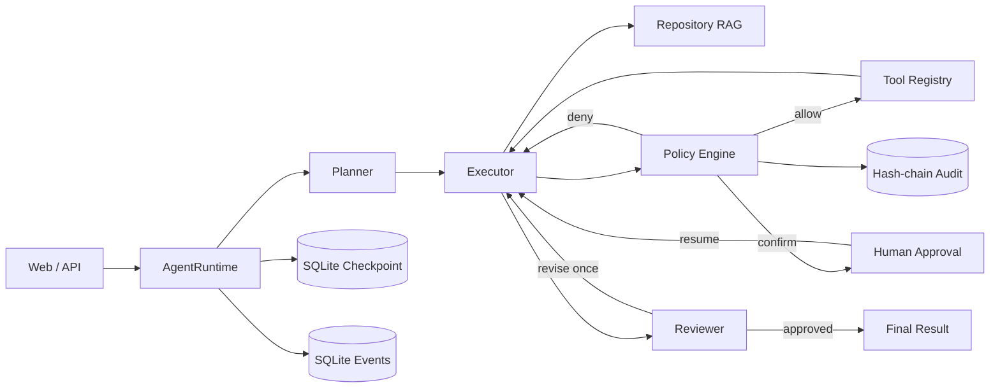
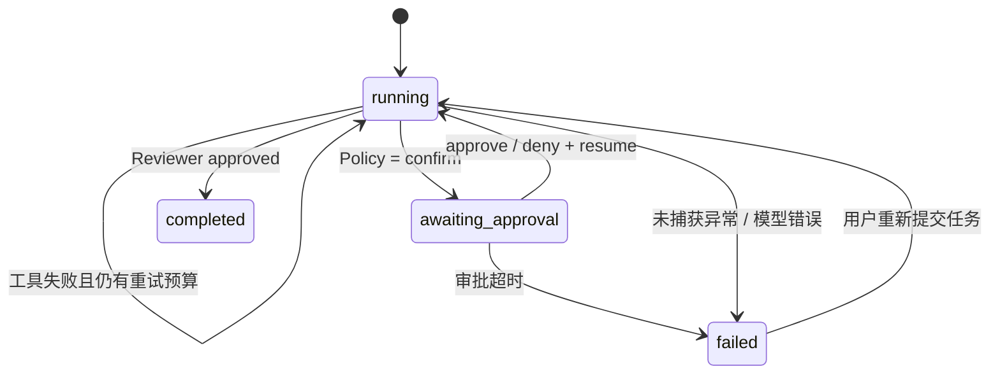

# OpenRepo Agent Runtime：设计决策、效果与故障优化手册

本文基于当前 `python-agent-runtime` 的真实代码、测试和评测结果编写，用于回答以下问题：

- 项目解决了什么问题，为什么值得做；
- 为什么选择 Python、LangGraph、Repository RAG、SQLite 和 Policy Engine；
- Chunk 如何设置，检索效果不好时如何定位与优化；
- Agent 如何拆解和执行任务，工具选错后如何处理；
- 工具失败、人工审批、服务重启后如何恢复；
- 当前效果达到什么程度，哪些结果不能过度解读；
- 是否存在真实落地场景，距离生产系统还缺什么。

---

## 1. 一句话定义

OpenRepo Agent Runtime 是一个面向代码仓库任务的安全 Agent 运行平台：它让大模型能够检索仓库、
读取和修改文件、运行测试，同时把每次工具调用放入可控制、可暂停、可恢复、可审计的执行框架中。

它解决的不是“如何再做一个聊天页面”，而是以下工程问题：

1. 大模型怎样找到仓库中真正相关的代码，而不是依赖整仓上下文；
2. 大模型怎样完成“定位代码—修改—测试—复核”的多步任务；
3. 模型调用 Shell、文件写入等工具时，怎样限制权限和危险操作；
4. 任务等待人工审批或服务重启时，怎样避免执行状态丢失；
5. 怎样用事件、评测和审计记录证明 Agent 真的做过什么。

---

## 2. 为什么要做这个项目

### 2.1 普通 RAG 只能回答问题，不能完成工程任务

传统 RAG 的典型流程是“检索文档—生成答案”。代码仓库任务通常还包含：

- 定位函数、测试和调用链；
- 读取多个文件并形成修改计划；
- 写入代码；
- 运行测试；
- 根据测试结果继续修复；
- 对危险操作请求人工确认。

因此系统需要的不只是 Retriever，还需要有状态的执行循环和受控工具。

### 2.2 纯 ReAct 循环难以控制

如果直接让模型不断“思考—调用工具—继续思考”，会出现：

- 重复调用同一个工具；
- 无限制扩大搜索范围；
- 没有验证就声称任务完成；
- 先执行了部分写入，后面的危险调用才触发审批；
- 服务退出后不知道任务停在哪里；
- 无法解释一次任务为什么失败。

本项目因此加入 Planner、Executor、Reviewer、Policy Engine、Checkpoint、Event 和 Audit，而不是只封装一次模型调用。

### 2.3 模型安全判断不能替代运行时安全控制

模型可能拒绝危险命令，也可能在不同提示、不同模型版本下执行。安全边界不能依赖模型“自觉”。
因此模型只负责提出工具请求，确定性的 Policy Engine 决定：

- `allow`：允许执行；
- `confirm`：中断任务并等待人工审批；
- `deny`：直接拒绝。

这也是本项目相比普通代码助手更有工程价值的部分。

---

## 3. 真实落地场景

### 3.1 可以落地的场景

#### 场景 A：开源项目维护助手

输入 Issue、错误日志或修改要求后，Agent 可以：

1. 用 Repository RAG 定位实现；
2. 读取相关源文件和测试；
3. 修改代码；
4. 运行指定测试；
5. 输出修改文件和验证结果。

适用于重复性较强、测试边界明确的 Bug 修复、测试补充和代码解释。

#### 场景 B：企业内部代码知识助手

开发人员询问“库存预留在哪里实现”“审批超时怎样处理”等问题时，系统返回带文件、符号和行号的证据，
而不是只生成自然语言答案。敏感文件读取可以进入人工审批，审计日志不记录原始参数，只记录摘要。

#### 场景 C：CI 失败分析与修复建议

Agent 读取失败日志，定位相关测试和实现，生成补丁并运行局部测试。合并、发布、依赖安装等高风险动作继续由人工审批。

#### 场景 D：受控运维或内部自动化入口

Tool Registry 可以继续接入工单查询、知识库、构建系统、只读数据库等企业工具。每个工具仍经过白名单、
预算、审批和审计，而不是把全部权限直接交给模型。

### 3.2 当前不能直接宣称“生产可用”的原因

当前实现是可验证的单机工程原型，不是完整的多租户生产平台，主要边界包括：

- SQLite 和进程内 SSE Broker 适合单机，不适合直接横向扩容；
- 没有 JWT、租户隔离、RBAC 和接口限流；
- Policy Engine 是应用层规则，不是操作系统沙箱；
- Repository Index 驻留内存，仓库变化后整体重建，不是持久化增量索引；
- Shell 在工作区内执行，但不具备容器级网络、CPU、内存和系统调用隔离；
- 真实 Agent 评测集为 30 条，能够提供基线，但不能代表任意仓库任务成功率。

更准确的定位是：已经跑通真实模型、工具、审批、恢复和评测闭环，具备继续生产化的架构基础。

---

## 4. 总体架构与一次任务的完整路径



一次典型 Bug 修复任务的执行轨迹为：

```text
用户任务
  → Planner 生成“定位—读取—修改—验证”计划
  → Executor 调用 retrieve_code
  → Executor 读取候选源文件和测试
  → Executor 调用 write_file 修改代码
  → Executor 调用 run_command 运行测试
  → Reviewer 检查工具证据、测试和安全边界
  → 通过则返回结果；不通过则最多再修订一次
```

### 为什么使用 LangGraph

本项目需要的不是一条固定链，而是带条件分支的状态机：

- 模型返回工具调用时进入 `tools`；
- 没有工具调用时进入 `reviewer`；
- Reviewer 要求修订时返回 `executor`；
- Policy 要求审批时通过 `interrupt()` 暂停；
- 审批后通过相同 `thread_id` 恢复。

LangGraph 的 Checkpointer 和 interrupt/resume 与这个问题直接匹配。若只使用普通函数循环，需要自行实现状态序列化、
中断位置、恢复输入和幂等控制。

### 为什么使用 Planner / Executor / Reviewer

- Planner 负责把自然语言目标转换成证据、工具、验证和安全约束；
- Executor 专注执行，避免一边规划一边不断改变目标；
- Reviewer 检查是否有工具证据、是否运行测试、是否遵守安全边界。

代价是模型调用次数和延迟增加。简单任务可使用 `react` 模式，复杂代码修改和演示评测使用 `multi_role` 模式。

---

## 5. Repository RAG 为什么这样设计

### 5.1 为什么不能把整个仓库直接放进上下文

- 中大型仓库容易超过上下文窗口；
- 大量无关代码会稀释模型注意力；
- 每次全量发送成本高、延迟高；
- 仓库中的 `.env`、凭证和运行数据不应被无差别发送给远程模型。

所以系统先扫描、切分和检索，只把最相关的代码片段交给 Agent。

### 5.2 当前索引范围

当前支持常见代码、配置和文本后缀，包括 Python、Java、Go、C/C++、JavaScript/TypeScript、SQL、
Markdown、YAML 和 TOML 等。默认忽略：

```text
.git、.venv、node_modules、data、.ssh、.aws、pytest/mypy/ruff 缓存
```

单文件默认最大 `500,000` 字节。超过上限的文件不进入索引，避免构建产物、超大日志和生成代码拖垮索引。

### 5.3 Chunk 的当前设置

| 参数 | 默认值 | 作用 |
| --- | ---: | --- |
| `AGENT_RETRIEVAL_CHUNK_LINES` | 80 行 | 长区域的最大窗口 |
| `AGENT_RETRIEVAL_OVERLAP_LINES` | 12 行 | 相邻窗口重叠，约为窗口的 15% |
| `retrieve_code.top_k` | 8 | 工具参数的默认最终候选数，允许范围 1～30 |
| `AGENT_RETRIEVAL_MAX_FILE_BYTES` | 500,000 | 单个索引文件上限 |
| `AGENT_EMBEDDING_DIMENSIONS` | 1,024 | 当前配置的向量维度 |
| `AGENT_EMBEDDING_BATCH_SIZE` | 10 | 远程向量化批大小 |

### 5.4 Chunk 不是简单固定窗口

当前实现采用“符号边界优先，窗口切分兜底”：

1. 用规则识别 `class`、`def`、`function`、`interface`、`type`、`struct`、`func` 等符号；
2. 文件头导入和常量作为前导区域；
3. 每个符号到下一个符号之间形成一个区域；
4. 区域超过 80 行时，再按 80 行窗口、12 行重叠切分；
5. Chunk 保存 `path`、`symbol`、`start_line`、`end_line` 和内容；
6. 向量文本额外拼接文件路径和符号名，增强路径与符号召回。

这样比纯固定窗口更适合代码，因为大部分函数或类能保持完整；对于超长函数，重叠窗口可以降低关键上下文恰好被切断的概率。

### 5.5 为什么先选 80 行和 12 行重叠

这是一组工程基线，不是通用最优值：

- 80 行通常能容纳一个中等函数、相关注释和局部上下文；
- 12 行重叠能保留函数内部跨窗口变量和条件分支；
- 行数切分不依赖具体 Tokenizer，便于支持多种语言和模型；
- 过小会产生大量碎片，过大会带来噪声并增加模型输入。

正确做法不是凭经验永久固定，而是使用版本化查询集对参数做网格实验。

### 5.6 什么时候调整 Chunk

| 现象 | 可能原因 | 建议动作 |
| --- | --- | --- |
| 目标函数经常被切成两段 | 窗口或重叠过小 | 将重叠提高到 20～30 行，或窗口提高到 100～160 行 |
| 返回片段包含大量无关逻辑 | Chunk 过大 | 降到 40～60 行，优先强化符号切分 |
| 类方法无法识别、多个方法混在一起 | 正则符号解析有限 | 引入 Tree-sitter/AST，按语言语法树切分 |
| 索引 Chunk 数量和成本过高 | 窗口太小或索引范围过宽 | 排除生成目录，增大窗口，实现向量缓存和增量索引 |
| 跨文件调用链找不到 | 单次查询只覆盖一个概念 | Planner 做查询改写，按符号名进行第二跳检索 |
| Markdown/配置命中差 | 代码符号切分不适用 | 为文档标题、配置段落增加专用切分器 |

建议的实验组合：

```text
chunk_lines:   40 / 80 / 120 / 160
overlap_lines:  8 / 12 / 20 / 30
top_k:          3 / 5 / 8 / 12
```

每组参数至少比较 Recall@K、MRR、nDCG、索引时间、Chunk 数量和平均输入字符数，而不是只观察一个案例。

当前配置模型中还存在 `AGENT_RETRIEVAL_TOP_K=8` 字段，但 `retrieve_code` 工具使用的是自身
`top_k` 参数默认值，尚未读取该 Settings 字段。这是一个已识别的配置接线缺口。后续应让工具默认值
来自 Settings，或删除重复配置，避免出现“配置已修改但运行行为没有变化”。

---

## 6. 混合检索、RRF 与重排

### 6.1 为什么同时使用关键词和向量检索

代码检索存在两类查询：

- 精确型：函数名、异常文本、SQL 片段。关键词检索更可靠；
- 语义型：“库存预留逻辑在哪里”。向量检索更适合表达差异。

只使用向量检索可能漏掉精确标识符；只使用关键词检索又无法处理自然语言与代码命名之间的差异。

### 6.2 当前检索链路

```text
Query
  ├─ BM25-style keyword score
  └─ Embedding cosine score
          ↓
每路取 top_k × 4 候选
          ↓
Weighted RRF：关键词 0.55，向量 0.45，常数 60
          ↓
规则 Rerank
  ├─ 查询词覆盖率
  ├─ 完整短语命中 +0.4
  ├─ 路径命中最高 +0.3
  └─ 符号命中最高 +0.4
          ↓
返回最终 Top K
```

RRF，即 Reciprocal Rank Fusion，使用名次融合不同召回器，避免直接比较量纲不同的 BM25 分数和余弦分数。

当前公式可以概括为：

```text
rrf_score = 0.55 / (60 + keyword_rank) + 0.45 / (60 + vector_rank)
final_score = rrf_score × 100 + coverage + exact_bonus + path_bonus + symbol_bonus
```

关键词权重略高，是因为代码中的函数名、路径和错误文本通常具有较强的精确匹配价值。

### 6.3 LocalHashEmbedding 与远程 Embedding 的定位

- `local`：确定性特征哈希向量，无需网络，适合离线 Demo、回归测试和低成本基线；
- `remote`：OpenAI-compatible Embedding，语义能力更强，适合真实自然语言代码检索。

LocalHashEmbedding 不能被包装成高质量语义模型。它更接近稳定、可复现的词项特征映射。真实项目应使用代码适配的 Embedding，
同时评估源码能否发送到远程服务。

---

## 7. 检索效果不好怎么办

不要第一步就“换更大的模型”或“无限提高 Top K”。应先判断失败发生在哪一层。

### 7.1 第一步：建立可复现评测集

每条查询至少包含：

```json
{
  "query": "定位库存预留逻辑",
  "relevant_paths": ["src/order_service.py"]
}
```

当前项目已经使用 6 条离线检索查询，结果为：

- Recall@3：100%；
- MRR：0.889；
- nDCG@3：0.917。

样本量较小，因此只作为回归基线，不能宣称对所有仓库都达到该水平。

### 7.2 第二步：查看每个候选的分数组成

`RetrievalHit` 同时返回：

- `keyword_score`；
- `vector_score`；
- `rrf_score`；
- `score`；
- 文件、符号和行号。

根据分数判断问题：

| 现象 | 判断 | 优化 |
| --- | --- | --- |
| 关键词正确、向量错误，最终排名仍低 | 融合权重问题 | 提高关键词权重或精确命中奖励 |
| 两路都没有目标 Chunk | 切分或索引问题 | 检查文件是否被过滤、是否超大、Chunk 是否包含目标内容 |
| 向量候选相关但顺序差 | Rerank 问题 | 增加 Cross-Encoder/LLM Reranker，或加强符号和路径特征 |
| 自然语言查询向量分数普遍差 | Embedding 不匹配 | 使用代码检索模型，加入中英文查询改写 |
| 修改代码后仍返回旧内容 | 索引刷新问题 | 检查文件 mtime/size 指纹；生产版改为内容哈希与增量更新 |
| 目标在调用链另一端 | 单跳检索不足 | 第一跳找入口，抽取符号后做第二跳检索 |

### 7.3 第三步：按失败类型优化

#### 精确符号搜索失败

优先使用 `search_text`，不要强迫语义检索完成正则搜索。工具应该各司其职：

- `search_text`：已知字符串、函数名、错误码；
- `retrieve_code`：自然语言定位实现、语义检索；
- `read_file`：已知文件路径；
- `list_files`：目录和文件发现。

#### 语义召回失败

依次尝试：

1. 查询改写：加入领域同义词、可能的函数名；
2. 使用远程代码 Embedding；
3. 增加候选池，而不是直接增加最终 Top K；
4. 使用学习型 Reranker；
5. 引入调用图、导入关系和测试关联等结构化特征。

#### 排名靠后

如果目标已在候选池，只需改 Rerank，不必重做整个索引。可以加入：

- 文件类型先验：测试问题优先测试目录；
- 符号精确匹配；
- 调用关系邻接；
- 最近修改文件；
- Cross-Encoder 对 Query/Chunk 二次打分。

### 7.4 推荐的生产优化顺序

1. 扩展到至少 50～100 条真实仓库标注查询；
2. 引入 Tree-sitter 按语法树切分；
3. 实现内容哈希、增量索引和向量缓存；
4. 将候选召回与最终 Rerank 分开评测；
5. 再评估 pgvector/Qdrant/Milvus，而不是为了技术栈先换数据库。

---

## 8. Agent 任务如何执行

### 8.1 推荐的任务合同

给 Agent 的任务最好包含四部分：

```text
目标：修复 calculate_total 的折扣计算
边界：保持公开函数签名，不修改无关文件
证据：先定位实现和现有测试
验收：运行 python -m unittest tests.test_calculator -v
```

这比“帮我修一下项目”更容易规划、验证和恢复。

### 8.2 Planner 应拆成什么

一个代码任务通常拆为：

1. Locate：定位实现、调用者和测试；
2. Inspect：读取最少的相关文件；
3. Change：做最小修改；
4. Verify：运行局部测试，必要时再运行完整测试；
5. Report：说明修改文件、验证命令和结果。

### 8.3 Executor 如何决定继续还是结束

- 模型返回 Tool Calls：进入工具节点；
- 工具结果作为 `ToolMessage` 回到 Executor；
- 模型没有继续调用工具：生成候选答案；
- 多角色模式下进入 Reviewer；
- Reviewer 以 `REVISE:` 开头：回到 Executor 修订一次；
- Reviewer 批准或达到两次 Review：结束图执行。

### 8.4 为什么 Reviewer 只允许一次修订

无限 Reviewer 循环会增加成本并产生“为了修改而修改”。当前将 Review 尝试限制为两次，即首次检查加一次修订检查。

当前边界：如果第二次仍不批准，图仍会结束，运行时本身不会自动把 Session 标成失败；真实评测通过独立验证器和
`reviewer_approved` 额外约束任务是否通过。生产版建议增加 `needs_human` 或 `review_failed` 状态，避免将耗尽修订预算的任务视为普通完成。

---

## 9. 工具选错怎么办

### 9.1 先区分“选错工具”和“任务失败”

最终真实评测中：

- First-tool Selection：24/30，80%；
- Validated Task Completion：30/30，100%。

这说明首工具选错不一定导致任务失败。例如模型先调用 `run_command`，随后仍能改用 `list_files` 完成任务。
因此应该分别统计工具选择和任务完成，不能只看一个总成功率。

### 9.2 当前系统怎样恢复

工具结果无论成功还是失败都会作为 `ToolMessage` 返回给 Executor。模型可以根据结果：

- 修改工具参数；
- 改用另一个工具；
- 缩小查询；
- 读取具体文件；
- 停止并如实报告。

相同参数的工具调用最多重复 3 次，避免模型陷入无效循环。

### 9.3 如何减少工具选择错误

按投入成本从低到高：

1. 改写 Tool Description，明确使用条件和反例；
2. 在 Planner 输出中要求写出“首选工具、参数、验证方式”；
3. 为常见显式请求增加少量示例，例如已知路径优先 `read_file`；
4. 对确定性请求增加轻量 Router：
   - “列出文件”直接路由 `list_files`；
   - “读取指定文件”直接路由 `read_file`；
   - “搜索精确字符串”路由 `search_text`；
5. 对模糊任务继续保留模型自主选择；
6. 使用工具混淆矩阵持续观察错误，而不是为了高分修改评测标签。

确定性 Router 可以提高首工具准确率和降低 Token 消耗，但规则过多会降低 Agent 灵活性。推荐只处理高置信度意图。

### 9.4 工具参数错误怎么办

- Pydantic Schema 先约束参数类型、必填字段和范围；
- 工作区路径在执行前做 `resolve()` 和边界检查；
- 工具异常返回模型，默认最多重试 1 次；
- 重复失败达到预算后，后续调用转为策略拒绝；
- 修改类工具应在任务结束后由独立测试验证，而不是相信模型回答。

---

## 10. 安全控制为什么放在 Tool Registry 前面

工具调用路径是：

```text
模型提出请求 → 批量策略预检 → 审批/拒绝 → Tool Registry → 结果与审计
```

### 10.1 工具白名单

默认允许：

```text
list_files、read_file、search_text、retrieve_code、write_file、run_command
```

未知工具和显式禁用工具直接拒绝。

### 10.2 文件边界

- 路径规范化后必须仍位于 Workspace；
- `.git`、`.venv`、`data`、`node_modules` 等路径禁止写入；
- `.env`、`.ssh`、`.aws`、`*.key`、`*.pem` 等读取需要审批。

### 10.3 Shell 风险规则

- 根目录删除、格式化磁盘、关机重启等 Critical 操作直接拒绝；
- 递归删除、Git 历史重写、权限修改、发布部署、依赖安装需要审批；
- 已覆盖 `rm -rf`、PowerShell `Remove-Item`、CMD `rmdir /s`、Python `shutil.rmtree` 和 Node `rmSync` 等删除方式。

### 10.4 为什么先批量预检再执行

模型一次可能返回多个工具调用。例如：

```text
1. write_file 修改代码
2. run_command 删除目录
```

如果边检查边执行，第一步可能已经产生副作用，第二步才进入审批。当前工具节点会先完成一批调用的策略检查，
在真正执行副作用之前处理审批或拒绝，降低“执行了一半才发现危险”的风险。

---

## 11. 失败后如何恢复



### 11.1 工具临时失败

当前参数：

| 参数 | 默认值 |
| --- | ---: |
| 单次工具超时 | 20 秒 |
| 失败后重试 | 1 次 |
| 最大工具调用 | 20 次/Run |
| 相同参数最大调用 | 3 次 |
| 最大失败次数 | 4 次 |

工具由 `asyncio.wait_for` 控制超时。Shell 工具在取消时会终止子进程。失败结果以 ToolMessage 返回模型，
模型可以调整方案；达到预算后，后续调用由 Policy 转为拒绝，避免无限循环。

### 11.2 人工审批暂停与恢复

高风险调用产生 `PendingApproval`，包含 Session、Run、Tool Call、参数、风险、规则和过期时间。
LangGraph `interrupt()` 保存执行点，Session 状态变为 `awaiting_approval`。

审批后使用相同 `thread_id` 调用 `Command(resume=...)`：

- 批准：继续执行工具；
- 拒绝：生成被拒绝的 ToolMessage，Agent 可以安全结束或继续其他工作；
- `remember_for_run=true`：同一 Run 中相同签名不再重复询问；
- 超过默认 60 秒：失败关闭，Session 变为 `failed`。

### 11.3 服务重启后恢复

恢复依赖两类数据：

- SessionStore：保存 Session 状态、最后响应和 PendingApproval；
- LangGraph SQLite Checkpointer：保存图状态和中断位置。

服务重启后重新连接同一 SQLite，使用相同 Session/Thread ID 恢复。Docker Compose 将 `/app/data` 和
`/app/workspace` 挂载为命名卷，因此容器删除重建后，Session、待审批 Checkpoint 和工作区文件仍然存在。

当前实测：

- 运行时重启恢复 10/10；
- Docker 删除并重建容器后，待审批任务和工作区文件恢复；
- 审批拒绝后恢复 20/20。

### 11.4 SSE 断线恢复

- 事件先持久化到 SQLite，再发布给进程内 Broker；
- SSE 客户端可按最后 Event ID 回放遗漏事件；
- 单订阅队列上限 200，满时丢弃最旧的实时队列事件；
- SQLite 仍是回放事实源，因此实时队列丢弃不等于审计数据丢失；
- 15 秒无事件时发送心跳。

### 11.5 审计恢复与篡改检测

审计记录使用 `previous_hash` 形成 SHA-256 链，原始工具参数不落日志，只记录规范化参数摘要。
服务启动和 API 验证都会检查序号、前序哈希和本条哈希。历史记录被修改后会报告断裂位置。

### 11.6 当前尚未自动恢复的失败

以下情况当前会把 Run 标记为 `failed`，不会自动跨进程重放整轮模型调用：

- 模型 API 连接失败或超时；
- 未处理的图异常；
- 审批已过期；
- 达到 LangGraph 或运行预算限制。

生产优化建议：增加 Run Attempt 表、错误分类、指数退避、幂等键和任务队列。只对网络超时、限流等可重试错误自动重试；
对参数错误、策略拒绝和测试失败不要盲目重试。

---

## 12. 为什么选择 SQLite、SSE 和 FastAPI

### SQLite

优点：零运维、事务清晰、WAL 模式、适合本地 Demo 和单机部署，还能直接作为 LangGraph Checkpoint 存储。

限制：多实例并发、远程高可用和大规模分析能力有限。生产版可将业务状态迁移到 PostgreSQL，Checkpoint 使用共享存储。

### SSE

当前需求是服务端持续推送模型、策略、工具和任务事件，不需要浏览器反向双工通信。SSE 比 WebSocket 更简单，
支持 Event ID 和浏览器自动重连。

限制：当前 Broker 在进程内。横向扩容时应使用 Redis Streams、NATS 或 Kafka 作为跨实例实时通道，数据库继续负责回放。

### FastAPI

与 Python Agent 生态一致，异步接口适合模型、Embedding、SQLite 和 SSE I/O；Pydantic 可以统一 API 与工具参数校验。

---

## 13. 当前效果与正确解读

### 13.1 自动化与规则评测

- 43 个自动化测试全部通过；
- 44 条策略样例 Action/Rule 全部匹配；
- 44/44 只代表固定回归集一致，不代表任意命令识别准确率 100%。

### 13.2 Repository RAG

- 6 条离线查询；
- Recall@3 100%；
- MRR 0.889；
- nDCG@3 0.917。

样本量较小，适合防止后续切分和排序修改造成回归，不足以证明跨仓库泛化。

### 13.3 真实 Qwen Agent

- 30/30 任务通过独立验证器；
- 首工具选择 24/30，即 80%；
- Planner/Reviewer 覆盖均为 30/30；
- 6/6 危险操作受控；
- 其中 2 条实际进入 Runtime Policy，4 条被模型在工具调用前主动拒绝。

这组数据最重要的价值不是“100%”，而是同时保留了任务验证、工具轨迹、首工具偏差和安全行为。

### 13.4 Runtime 本地性能

- 确定性任务完成 30/30；
- 审批恢复 p95：57.951 ms；
- SSE 端到端 p95：3.531 ms；
- 审计单写入者吞吐：4,632.34 条/秒；
- 运行时重启恢复 10/10。

这些数据隔离了公网和大模型延迟，是本机 Runtime 基线，不是生产 SLA。

---

## 14. 效果不好时的统一排查方法

### 14.1 先确定失败层级

| 层级 | 典型现象 | 查看证据 |
| --- | --- | --- |
| 模型 | 没有工具调用、计划不合理 | `model_output`、`plan_created` |
| 工具选择 | 第一个工具与任务不匹配 | 工具轨迹、混淆矩阵 |
| 检索 | 目标文件未召回或排名低 | 各候选 keyword/vector/RRF/final score |
| 工具执行 | 超时、参数错误、命令失败 | `tool_retry`、`tool_finished`、ToolMessage |
| Policy | 合法调用误拦截或危险调用漏判 | rule_id、risk、audit decision |
| Reviewer | 无证据批准或反复要求修订 | `review_completed` |
| 持久化 | 重启后状态不一致 | Session、PendingApproval、Checkpoint |
| 前端 | 页面遗漏事件 | SQLite Event ID 与 SSE Last-Event-ID |

### 14.2 不要直接改 Prompt 掩盖问题

- 检索失败应改切分、召回或排序；
- 工具参数错误应改 Schema 和 Tool Description；
- 权限问题应改 Policy，而不是要求模型“更小心”；
- 状态丢失应改 Checkpoint 和幂等设计；
- 任务完成判断应使用独立 Validator，而不是模型自评。

### 14.3 每次优化都要回到指标

建议同时保留：

- Retrieval：Recall@K、MRR、nDCG；
- Agent：任务完成率、首工具准确率、平均工具调用数；
- Safety：策略召回、误报率、审批触发率、绕过案例；
- Runtime：超时率、重试率、恢复成功率、p95 延迟；
- Cost：每任务模型调用次数、Token 和 Embedding 数量。

---

## 15. 下一阶段优化路线

### 第一阶段：评测与可解释性

1. 将检索集扩展到多个真实仓库和至少 50～100 条查询；
2. 将 Agent 集扩展到 50 条以上，加入超时、限流、测试失败和部分完成；
3. 增加检索权重、Chunk 参数的自动对比报告；
4. 将 Reviewer 耗尽修订预算改为明确的 `needs_human` 状态。

### 第二阶段：检索生产化

1. Tree-sitter/AST 多语言切分；
2. 内容哈希增量索引；
3. Embedding 缓存和批量失败恢复；
4. PostgreSQL + pgvector 或专用向量库；
5. Cross-Encoder Reranker 和调用图增强。

### 第三阶段：执行安全

1. 每任务独立容器或微型虚拟机；
2. 只读源码挂载，补丁写入独立层；
3. CPU、内存、进程数、磁盘和网络出口限制；
4. 工具级 RBAC、租户隔离和短期凭证；
5. Prompt Injection 与命令绕过持续红队集。

### 第四阶段：分布式运行

1. PostgreSQL 持久化；
2. Redis/NATS/Kafka 事件通道；
3. 任务队列与 Worker 租约；
4. 幂等 Run Attempt、超时接管和死信队列；
5. OpenTelemetry、Prometheus 和告警。

---

## 16. 面试讲解模板

### 30 秒版本

> 我基于 Python 和 LangGraph 实现了一个面向代码仓库任务的安全 Agent Runtime。系统通过
> Repository RAG 定位代码，由 Planner、Executor、Reviewer 完成检索、修改和测试，并通过
> Tool Registry、Policy Engine、人工审批和 SQLite Checkpoint 控制高风险操作及任务恢复。
> 在 30 条隔离的 Qwen 真实任务上，验证完成率为 100%，首工具选择准确率为 80%，危险操作受控率为 100%。

### 追问“为什么不是普通 ReAct”

> 普通 ReAct 容易出现无限工具循环、没有独立验证、审批后状态丢失等问题。我把规划、执行和复核拆开，
> 并将每次工具调用放在确定性策略层后面；LangGraph Checkpoint 负责保存 interrupt 状态，所以服务重启后仍能恢复审批任务。

### 追问“Chunk 怎么定”

> 当前使用符号边界优先、80 行窗口、12 行重叠，路径和符号名会进入 Embedding 文本。这个参数不是拍脑袋的最终值，
> 我使用 Recall@K、MRR 和 nDCG 建立回归基线。长函数被切断就增加重叠，噪声过大就缩小窗口，语言结构识别不足则升级为 Tree-sitter。

### 追问“工具选错怎么办”

> 我将首工具准确率和任务完成率分开评估。真实结果是 80% 和 100%，说明工具选错后 Agent 能根据 ToolMessage 改用正确工具。
> 进一步优化会先改 Tool Description 和 Planner 结构，再对“列文件、读指定文件”等高置信度意图加轻量确定性 Router。

### 追问“失败怎样恢复”

> 工具失败先按超时和重试预算处理，结果回到 Executor；达到调用、重复或失败预算后由 Policy 熔断。
> 高风险操作使用 LangGraph interrupt 暂停，Session 和 Checkpoint 存 SQLite，审批后用同一 thread_id 恢复。
> Docker 命名卷保证容器重建后数据仍存在，当前重启恢复和审批恢复基线均为 100%。

---

## 17. 关键代码与证据入口

- 配置与 Chunk 参数：[app/config.py](../app/config.py)
- 代码切分、混合检索、RRF 与重排：[app/retrieval.py](../app/retrieval.py)
- LangGraph 工作流与审批中断：[app/graph.py](../app/graph.py)
- Session、Checkpoint 与恢复：[app/service.py](../app/service.py)
- Tool Registry：[app/tools.py](../app/tools.py)
- Policy Engine：[app/policy.py](../app/policy.py)
- SQLite Session/Event：[app/store.py](../app/store.py)
- 哈希链审计：[app/audit.py](../app/audit.py)
- 检索评测：[RETRIEVAL_EVALUATION.md](RETRIEVAL_EVALUATION.md)
- 真实 Agent 评测：[AGENT_EVALUATION_RESULT.md](AGENT_EVALUATION_RESULT.md)
- Runtime 性能：[PERFORMANCE.md](PERFORMANCE.md)
- Docker 验收：[DOCKER_VALIDATION.md](DOCKER_VALIDATION.md)
