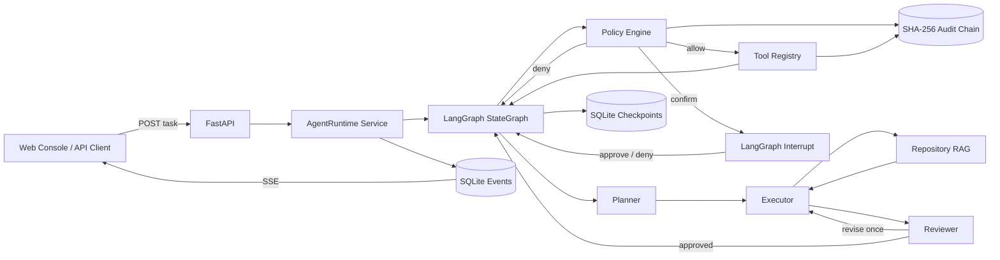
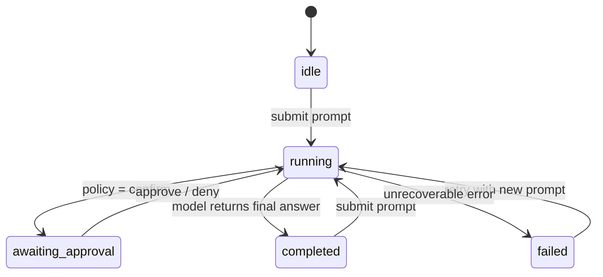

# Architecture

## Runtime flow



The model proposes actions but never calls operating-system capabilities directly. Every tool request
passes through a deterministic policy layer. The graph is interrupted before a confirm-class action and
continues from its SQLite checkpoint only after an explicit approval decision.

Repository RAG performs symbol-aware/windowed chunking, local or OpenAI-compatible embeddings,
BM25-style keyword retrieval, vector cosine retrieval, weighted reciprocal-rank fusion, and a metadata/
coverage reranker. Remote embeddings are opt-in because repository chunks leave the local process.

## State machine



Session metadata and observable events are stored in application-owned SQLite tables. LangGraph writes
graph checkpoints into the same database through a separate connection. This separates API/query data
from workflow restoration while keeping local deployment simple.

## Safety boundaries

| Boundary | Mechanism | Failure behavior |
| --- | --- | --- |
| Tool capability | Explicit allowlist registry | Unknown and disabled tools are denied |
| Filesystem | Canonical path resolution | All paths outside the workspace are denied |
| Sensitive data | Path patterns | Reads require approval; audit stores only argument hashes |
| Shell actions | Ordered risk rules | Critical commands denied; high-risk commands interrupted |
| Runaway loops | Call, repetition, and failure budgets | Further calls are converted to policy denials |
| Slow tools | Async timeout and retry budget | Child process is killed on cancellation |
| Forensics | Hash-linked JSONL records | Startup and API verification fail on tampering |

The policy engine is a guardrail, not an OS sandbox. For hostile code, run the service inside a container or
micro-VM and restrict network, mounts, credentials, and process privileges independently.

## Data model

```text
sessions 1 ─────── * events
   │
   └── thread_id ── LangGraph checkpoints / writes

audit.jsonl
   record[n].previous_hash == record[n-1].hash
```

SSE uses persisted event IDs, so a reconnecting browser can request events after its last observed ID.
The process-local broker supplies low-latency delivery; SQLite remains the source of truth.
